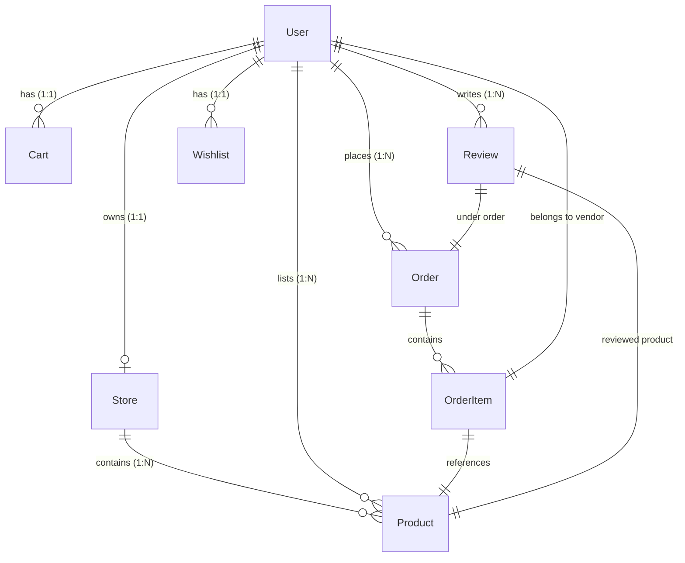

# Database Schema Diagram & Documentation

This document describes the Mongoose models, data schemas, collections, compound indexes, and entity relationships for the **Artisan's Corner** marketplace database.

## Entity Relationship (ER) Diagram

---

## Collections Definition

### 1. Users (`users`)
Stores profile information, hashed passwords, contact details, and account authorization roles.

| Field | Type | Description |
| :--- | :--- | :--- |
| `_id` | ObjectId | Unique identifier |
| `name` | String | User's full name (required) |
| `email` | String | Lowercase unique email address (index, required) |
| `password` | String | Hashed password (hidden in selections) |
| `phone` | String | Contact phone number |
| `role` | String | Enum: `BUYER` (default), `VENDOR`, `ADMIN` |
| `isActive` | Boolean | True if account is enabled (default: true) |
| `isEmailVerified` | Boolean | True if email has been verified (default: false) |
| `avatar` | Object | `{ url, publicId }` profile photo |
| `createdAt` | Date | Auto timestamps |
| `updatedAt` | Date | Auto timestamps |

**Indexes**:
- `{ email: 1 }` (Unique)

---

### 2. Stores (`stores`)
Holds shop banners, descriptions, addresses, approvals, and mapping references to vendor accounts.

| Field | Type | Description |
| :--- | :--- | :--- |
| `_id` | ObjectId | Unique identifier |
| `owner` | ObjectId | Reference to `User` (Unique, required) |
| `name` | String | Shop name (Unique, required) |
| `slug` | String | Unique slug generated from name (required) |
| `logo` | Object | `{ url, publicId }` shop logo |
| `description` | String | Shop bio story (required) |
| `phone` | String | Shop contact phone (required) |
| `address` | Object | `{ street, city, state, postalCode, country }` (required) |
| `isApproved` | Boolean | True if admin approved (default: false) |
| `status` | String | Enum: `ACTIVE` (default), `INACTIVE` |

**Indexes**:
- `{ owner: 1 }` (Unique)
- `{ name: 1 }` (Unique)
- `{ slug: 1 }` (Unique)

---

### 3. Products (`products`)
Houses catalog details, categorization, inventory balances, pricing comparison records, and slugs.

| Field | Type | Description |
| :--- | :--- | :--- |
| `_id` | ObjectId | Unique identifier |
| `vendor` | ObjectId | Reference to `User` (required) |
| `store` | ObjectId | Reference to `Store` (required) |
| `name` | String | Product name (required) |
| `slug` | String | Unique product slug (required) |
| `description` | String | Detailed product details (required) |
| `category` | String | Product craft category (index, required) |
| `price` | Number | Active price (required) |
| `compareAtPrice` | Number | Original price for sale calculations |
| `images` | Array | Array of `{ url, publicId }` |
| `stock` | Number | Stock balance quantity (required) |
| `sku` | String | Unique product SKU (required) |
| `rating` | Number | Average rating (default: 0) |
| `numReviews` | Number | Review count (default: 0) |
| `isActive` | Boolean | True if listed (default: true) |
| `isFeatured` | Boolean | True if highlighted on home (default: false) |

**Indexes**:
- `{ slug: 1 }` (Unique)
- `{ sku: 1 }` (Unique)
- `{ category: 1, price: 1, rating: 1 }` (Compound filter index)
- `{ name: "text", description: "text" }` (Fulltext search index)

---

### 4. Carts (`carts`)
Stores persistent client cart items for registered users.

| Field | Type | Description |
| :--- | :--- | :--- |
| `_id` | ObjectId | Unique identifier |
| `user` | ObjectId | Reference to `User` (Unique, required) |
| `items` | Array | List of `{ product, vendor, quantity, price }` |
| `subtotal` | Number | Calculated sum of items (auto calculated on pre-save) |

**Indexes**:
- `{ user: 1 }` (Unique)

---

### 5. Orders (`orders`)
Holds billing summaries, snapshots of items at purchase, Stripe payment intent IDs, platform commission fee calculations, and delivery tracking.

| Field | Type | Description |
| :--- | :--- | :--- |
| `_id` | ObjectId | Unique identifier |
| `orderNumber` | String | Autogenerated serial number (index, required) |
| `buyer` | ObjectId | Reference to `User` (required) |
| `items` | Array | List of `{ product, vendor, productName, image, quantity, unitPrice, subtotal, platformFee, vendorPayout, deliveryStatus }` |
| `shippingAddress` | Object | `{ street, city, state, postalCode, country, phone }` |
| `subtotal` | Number | Sum of item subtotals |
| `platformFee` | Number | Sum of 5% platform commission fees calculated server-side |
| `vendorPayout` | Number | Sum of net seller payout shares calculated server-side |
| `shippingFee` | Number | Flat rate shipping fee |
| `tax` | Number | Tax surcharge amount |
| `totalAmount` | Number | Total amount charged (`subtotal + tax + shippingFee`) |
| `paymentStatus` | String | Enum: `PENDING` (default), `PAID`, `FAILED`, `REFUNDED` |
| `orderStatus` | String | Enum: `PROCESSING` (default), `CONFIRMED`, `SHIPPED`, `DELIVERED`, `CANCELLED` |
| `stripePaymentIntentId` | String | Intent ID for Stripe webhooks validation |

**Indexes**:
- `{ orderNumber: 1 }` (Unique)
- `{ stripePaymentIntentId: 1 }`
- `{ "items.vendor": 1 }`

---

### 6. Reviews (`reviews`)
Maintains comments and rating scores. Verified purchase badge is linked to order deliveries.

| Field | Type | Description |
| :--- | :--- | :--- |
| `_id` | ObjectId | Unique identifier |
| `product` | ObjectId | Reference to `Product` (index, required) |
| `user` | ObjectId | Reference to `User` (required) |
| `order` | ObjectId | Reference to `Order` (required) |
| `rating` | Number | Integer between 1 and 5 (required) |
| `comment` | String | Comment text description (required) |
| `isVerifiedPurchase` | Boolean | True if user bought product (default: false) |

**Indexes**:
- `{ product: 1, user: 1, order: 1 }` (Unique compound index)

---

### 7. Wishlists (`wishlists`)
Holds favorited product lists.

| Field | Type | Description |
| :--- | :--- | :--- |
| `_id` | ObjectId | Unique identifier |
| `user` | ObjectId | Reference to `User` (Unique, required) |
| `products` | Array | Array of `Product` object IDs |

**Indexes**:
- `{ user: 1 }` (Unique)
